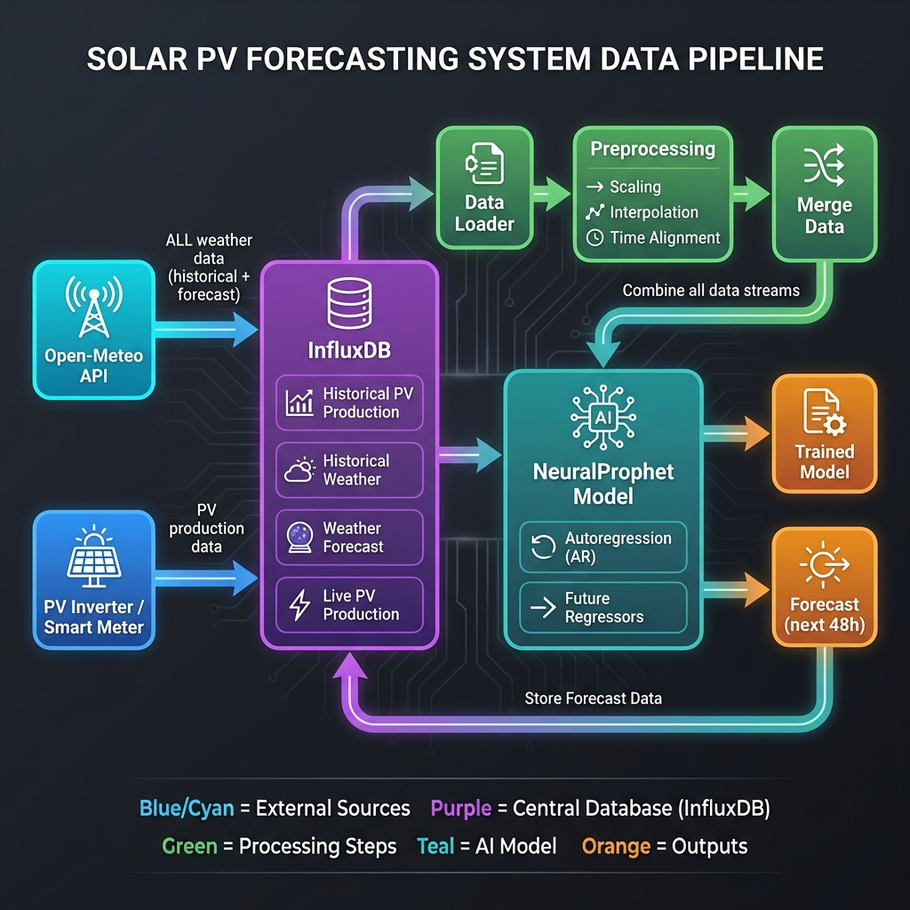
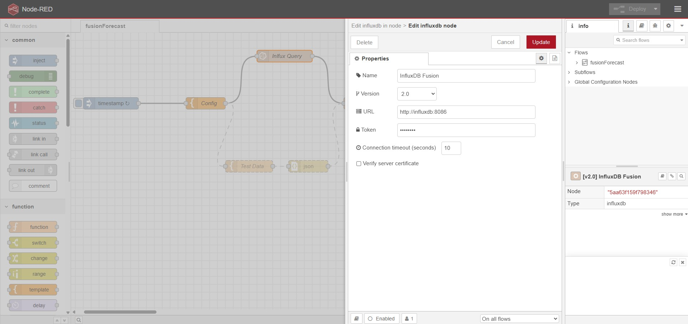
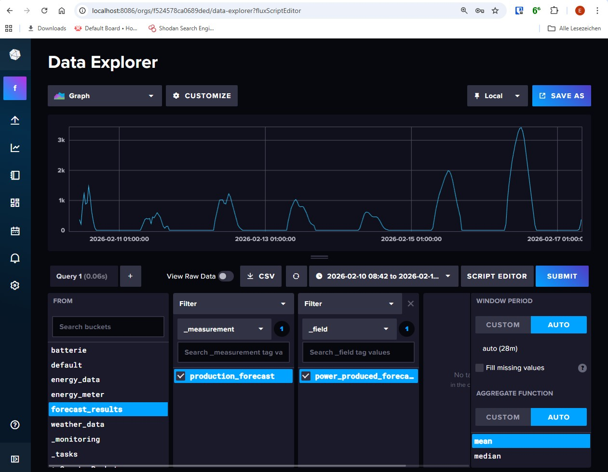

# FusionForecast

FusionForecast is an ML-based tool for forecasting time series data (e.g., PV generation) using [**NeuralProphet**](https://neuralprophet.com/), [**InfluxDB**](https://www.influxdata.com/) and [**Open-Meteo**](https://open-meteo.com/). It trains a model based on historical data and external regressors (e.g., weather forecasts) and writes the forecasts back into an InfluxDB.

## Data Flow




## Features

- **Data Source**: Reads training data (target value and regressor) from InfluxDB.
- **Modeling**: Uses NeuralProphet (PyTorch) for time series forecasting.
- **Intraday Correction**: Dual-mechanism approach for real-time forecast adjustments:
  - **AR-Net**: Learns autoregressive patterns from the last 24 hours of production to capture short-term trends.
  - **Intraday Correction**: The AR mechanism automatically uses recent live production data to adjust the forecast start point.
- **Server-Side Aggregation**: Performs downsampling (e.g., to 1h means) directly in the database.
- **Configurable**: All settings (buckets, measurements, offsets) are defined in `settings.toml`.
- **Offset Support**: Supports time offsets for regressors (e.g., to adjust time zones or lead times).

## Prerequisites

- Python 3.9+
- InfluxDB v2
- Access to relevant InfluxDB buckets
- **Historical PV Data:** At least 30 days of historical generation data are required for training. Ideally, 1 to 2 years of data should be available for better accuracy.
    - **Frequency:** Data should preferably be stored every 15 to 60 minutes. It is not critical if individual data points are missing; the system is designed to handle gaps and inexact timestamps.
    - **Timezone:** The correct timezone must be observed. The system operates in UTC.

## Manual Installation
For manual installation details, please refer to [manual_installation.md](doc/manual_installation.md).

## Docker Deployment (Recommended)

For production use, Docker provides the easiest and most reliable deployment method. The setup includes:
- **Zero-Manual-Config**: `settings.toml` is automatically generated and synchronized from your `.env`.
- **Auto-Initialization**: InfluxDB is automatically set up with all required buckets.
- **Persistent Data**: Models, logs, and Node-RED flows are stored on the host for persistence.
- **Node-RED Integration**: Access the specialized solar control logic at `http://localhost:1880`.

### Quick Start

1. **Clone Repository & Prepare Configuration**:
   ```bash
   git clone https://github.com/ActronX/fusionForecast
   cd fusionForecast/docker
   
   # Copy and edit environment variables
   cp .env.example .env
   nano .env  # Set your coordinates and passwords
   ```

2. **Prepare Data (Recommended)**:
   - Place your historical data file as `measurements.csv` in the project root (one level up). See the **[Data Import Guide](doc/import_data.md#1-importing-historical-data-required-for-training)** for CSV format details.
   - Edit `docker-compose.yml` (already in `docker/` folder) and uncomment the volume line:
     ```yaml
     volumes:
       - ../measurements.csv:/app/measurements.csv
     ```

3. **Start Containers**:
   ```bash
   docker-compose up -d
   ```
   
   This will:
   - Start InfluxDB and create all required buckets automatically.
   - Dynamically generate `settings.toml` inside the container using your `.env` values.
   - Set up automated forecasts every 15 minutes via Cron.

4. **Monitor Setup**:
   ```bash
   # Watch logs during initial setup
   docker-compose logs -f fusionforecast
   
   # Check container status
   docker-compose ps
   ```

5. **Access InfluxDB Dashboard**:
   - URL: [http://localhost:8086](http://localhost:8086)
   - Username: `admin` (or as defined in your setup)
   - Password: `password` (or as defined in your setup)
   - Organization: `fusionforecast`


6. **Access Node-RED**:
   - URL: [http://localhost:1880](http://localhost:1880)
   - Configuration: Use the Flow Editor to adjust logic or view status.
   - **Note**: When you first start, you might need to manually set the credentials (Influx Token) in the Node-RED UI.
   

   


### Configuration via `.env`

The Docker setup uses environment variables to configure both InfluxDB and the application.

| Variable | Description | Default |
| :--- | :--- | :--- |
| `INFLUXDB_TOKEN` | API Token for InfluxDB access. | (Predefined) |
| `INFLUXDB_ORG` | Organization name in InfluxDB. | `fusionforecast` |
| `STATION_LATITUDE` | Decimal latitude of your location. | `52.5200` |
| `STATION_LONGITUDE` | Decimal longitude of your location. | `13.4050` |
| `STATION_TILT` | Tilt (0=flat, 90=vertical). | `30` |
| `STATION_AZIMUTH` | Azimuth (0=South, -90=East, 90=West). | `0` |
| `STATION_ALTITUDE` | Station altitude in meters. | `0` |
| `MODEL_TRAINING_DAYS`| Days of history to use for training. | `30` |
| `MAX_POWER_CLIP` | Max system output in Watts (outlier clipping).| `6000` |


### Importing Historical PV Data

To train the model, you must push historical data into InfluxDB.

👉 **[Read the full Data Import Guide](doc/import_data.md)** for details on:
- CSV Import (Volume or Manual)
- Manual Injection via Curl
- Pushing Live Data for Intraday Correction

### Container Management & Manual Execution

👉 **[Read the full Docker Management Guide](doc/docker_management.md)** for details on:
- Starting/Stopping/Restarting containers
- Viewing Logs
- **Manually triggering scripts** (Train, Forecast, Fetch Weather) inside the container

### Data Persistence

Docker volumes ensure your data survives container restarts:
- **influxdb-data**: All InfluxDB measurements and forecasts.
- **./models**: Trained NeuralProphet models (mounted from host).
- **./logs**: Application logs (mounted from host).

### Automated Updates

The container automatically:
- ✅ Fetches weather forecasts every 15 minutes.
- ✅ Generates PV forecasts with intraday correction every 15 minutes.
- ✅ Retrains model monthly (1st of month at 02:00).

### Technical Overview

For a detailed description of the scripts and data flow, please refer to the **[Technical Overview](doc/technical_overview.md)**.

### InfluxDB Login Guide for FusionForecast



👉 **[Read the InfluxDB Documentation](doc/influxdb-login-guide.md)**
# Smart Consumer Control (Node-RED)

For users who want to use the forecast data to control physical devices (e.g., heating, EV charging), I provide a ready-to-use **Node-RED** flow.


`[Inject] --> [Template] --> [InfluxDB] --> [Function] --> [Output]`

Instead of simple threshold switching, it calculates the **projected solar energy surplus** for the next 24 hours. It switches the consumer **ON** only if the surplus is sufficient to cover the runtime costs without draining the home battery below a reserved level.

It includes advanced protection features:
* **Hysteresis:** Prevents rapid toggling ("flip-flopping") by requiring a specific charge level recovery.
* **Dynamic Reserve:** Maintains a high safety buffer when battery is low, but reduces it when battery is full to maximize capacity usage.
* **Safety Guard:** Prevents operation if forecast data is incomplete or outdated.
* **Real-Time Forecast Correction:** Dynamically adjusts the forecast curve ("Damping Factor") based on the actual solar performance since sunrise. If the day is cloudier/sunnier than predicted, the future forecast is scaled accordingly.
* **Battery Protection:** Hard cutoff when SoC is critically low.

👉 **[Read the full Node-RED Logic Documentation](node_red/README.md)**

### Integration & Deployment

Node-RED is fully integrated into the Docker environment.
*   **Access:** [http://localhost:1880](http://localhost:1880)
*   **Credentials:** Managed securely via `flows_cred.json` and environment variables.
*   **Persistence:** Flows are saved to `node_red/flows.json`.

👉 **[Read the Node-RED Integration Guide](doc/nodered_integration.md)** for details on Docker setup, Git workflow, and troubleshooting.
