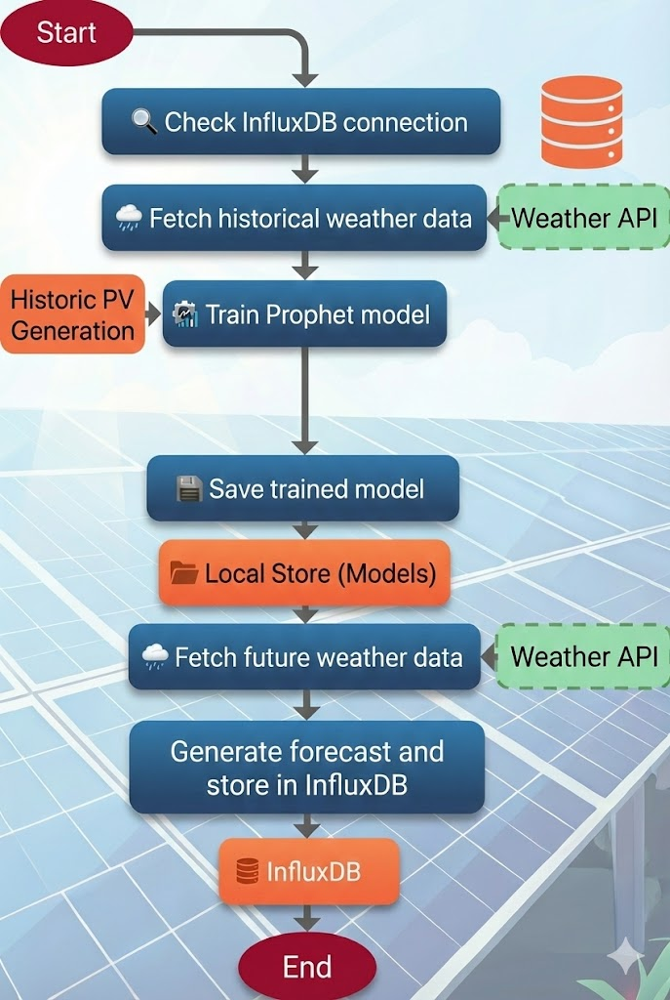

# FusionForecast

FusionForecast is an ML-based tool for forecasting time series data (e.g., PV generation) using [**Prophet**](https://facebook.github.io/prophet/), [**InfluxDB**](https://www.influxdata.com/) and [**Open-Meteo**](https://open-meteo.com/). It trains a model based on historical data and external regressors (e.g., weather forecasts) and writes the forecasts back into an InfluxDB.



## Features

- **Data Source**: Reads training data (target value and regressor) from InfluxDB.
- **Modeling**: Uses Facebook Prophet for time series forecasting.
- **Server-Side Aggregation**: Performs downsampling (e.g., to 1h means) directly in the database.
- **Configurable**: All settings (buckets, measurements, offsets) are defined in `settings.toml`.
- **Offset Support**: Supports time offsets for regressors (e.g., to adjust time zones or lead times).

## Prerequisites

- Python 3.9+
- InfluxDB v2
- Access to relevant InfluxDB buckets
- **Historical PV Data:** At least 30 days of historical generation data are required for training. Ideally, 1 to 2 years of data should be available for better accuracy.
    - **Frequency:** Data should preferably be stored every 15 to 60 minutes. It is not critical if individual data points are missing; the system is designed to handle gaps and inexact timestamps.
    - **Timezone:** The correct timezone must be observed. The system operates in UTC. An offset can be defined in the settings.

## Installation

1. Clone or extract the repository.
2. Create virtual environment and install dependencies:

   **Windows:**
   ```batch
   python -m venv venv
   venv\Scripts\activate
   pip install -r requirements.txt
   ```

   **Linux/Mac:**
   ```bash
   chmod +x install_deps.sh
   ./install_deps.sh
   ```
   This script installs system dependencies, creates the venv, and necessary folders via `install_deps.sh`.

## Configuration

Configuration is managed via the `settings.toml` file.

> **Initial Setup:** Before starting, rename `settings.example.toml` to `settings.toml` and fill in your credentials.

**This file is fully documented with comments for every setting.** Please refer to it for detailed explanations of all parameters.

### Important Settings Sections

- **[influxdb]**: URL, Token, and Org for database connection.
- **[buckets]**: Names of source and target buckets.
- **[measurements] / [fields]**: Names of Measurements and Fields in InfluxDB.
- **[preprocessing]**:
    - `max_power_clip`: Upper limit for outlier clipping.
    - `regressor_offset`: Time offset for the regressor (e.g., `"-1h"`), applied via `timeShift()`.
- **[forecast_parameters]**:
    - `training_days`: Past period of training data (e.g., 731 days).
    - `forecast_days`: Forecast horizon into the future (e.g., 14 days).
- **[prophet]**:
    - `regressor_prior_scale`: Prior scale for the regressor (controls flexibility).
    - `seasonality_mode` / `regressor_mode`: Additive or Multiplicative.

- **[open_meteo]** / **[open_meteo.historic]** / **[open_meteo.forecast]**:
    - Settings for fetching weather data (location, API URLs, models).
    - `minutely_15`: Specifies the 15-minute weather variable to fetch (e.g., `global_tilted_irradiance_instant`).
- **[open_meteo]**:
    - `latitude` / `longitude`: GPS coordinates of your PV system.
    - `azimuth`: Orientation of the PV panels (0 = South, -90 = East, 90 = West).
    - `tilt`: Tilt angle of the PV panels.

## Usage Workflow

### 1. Verify Connection

Before proceeding, you can verify the connection to your InfluxDB instance.

**Start:**
- Windows: `test_connection.bat`
- Linux: `./test_connection.sh`

### 2. Fetch Historical Weather Data

Before training the model, you must fetch historical weather data for your location to train the regressor.

**Start:**
- Windows: `fetch_historic_weather.bat` or `python -m src.fetch_historic_weather`
- Linux: `./fetch_historic_weather.sh` or `python3 -m src.fetch_historic_weather`

### 3. Train Model

The training script loads historical data, trains the Prophet model, and saves it locally as a `.pkl` file.

**Start:**
- Windows: `train.bat` or `python -m src.train`
- Linux: `./train.sh` or `python3 -m src.train`

### 4. Fetch Future Weather Data

Before creating a forecast, you must fetch the latest weather forecast from DWD/Open-Meteo. This data serves as the regressor for the prediction.

**Start:**
- Windows: `fetch_future_weather.bat` or `python -m src.fetch_future_weather`
- Linux: `./fetch_future_weather.sh` or `python3 -m src.fetch_future_weather`

### 5. Create Forecast

The forecast script loads the saved model and future regressor data (e.g., weather forecast), calculates the forecast, and writes it to InfluxDB.

**Start:**
- Windows: `forecast.bat` or `python -m src.forecast`
- Linux: `./forecast.sh` or `python3 -m src.forecast`

### 6. Run Pipeline (Full Automation)

Executes the complete workflow in order:
1. **Connection Test**: Checks InfluxDB health.
2. **Fetch Historic Weather**: Updates historic data.
3. **Fetch Future Weather**: Updates forecast data.
4. **Train Model**: Retrains the model.
5. **Create Forecast**: Generates the forecast.

**Start:**
- Windows: `run_pipeline.bat`
- Linux: `./run_pipeline.sh`

### 7. Hyperparameter Tuning

To optimize the model's accuracy, you can tune the hyperparameters (e.g., `changepoint_prior_scale`, `seasonality_mode`) using a grid search. The parameters to be tested are defined in `settings.toml` under `[prophet.tuning]`.

**Start:**
- Windows: `tune.bat` or `python -m src.tune`
- Linux: `./tune.sh` or `python3 -m src.tune`

#### Evaluation Metrics

The tuning script evaluates model performance using Cross-Validation and calculates the following metrics. **Note**: To ensure relevance for PV systems, values below the `night_threshold` (defined in settings, e.g., 50 W) are **excluded** from these calculations. This prevents the metrics from being artificially improved by easy "0 Watt" predictions during the night.

*   **RMSE (Root Mean Squared Error)**:
    *   **What it is**: The square root of the average squared differences between incorrect forecasts and actual values.
    *   **PV Context**: RMSE penalizes **large errors** more heavily than small ones. This is critical for battery management: a single large prediction error (e.g., predicting 5kW when it's 2kW) can disrupt your charging strategy more than many small errors. A lower RMSE means fewer "big surprises".

*   **MAE (Mean Absolute Error)**:
    *   **What it is**: The average absolute difference between the forecast and the actual value.
    *   **PV Context**: This tells you, on average, how many Watts your forecast is off. It gives a linear representation of error and is easy to interpret. If MAE is 500W, your forecast is on average 500W deviation from reality.

*   **MAPE (Mean Absolute Percentage Error)**:
    *   **What it is**: The average error expressed as a percentage of the actual value.
    *   **PV Context**: Useful for understanding relative performance. A 10% MAPE means the model is usually within 10% of the actual generation. However, be cautious: MAPE can be erratic when production is very low (near the threshold), which is why filtering night values is crucial.

## Folder Structure

- `src/`: Source code (Python scripts).
- `models/`: Storage location for trained models (`prophet_model.pkl`).
- `node_red/`: Node-RED flows and documentation for consumer control.
- `settings.toml`: Configuration file.
- `requirements.txt`: Python dependencies.


## Script Overview

Here is a detailed description of the Python scripts located in `src/`:

### Core Pipeline
- **`src/train.py`**: Trains the **Production** (PV) model. Fetches historical production and regressor data, trains Prophet, and saves `prophet_model.pkl`.
- **`src/forecast.py`**: Generates **Production** forecasts. Loads the model, fetches future weather data, predicts generation, and writes to InfluxDB.

### Data Fetching
- **`src/fetch_future_weather.py`**: Fetches **current** weather forecasts from Open-Meteo (DWD ICON-D2) for the next few days and stores them in InfluxDB (used for forecasting).
- **`src/fetch_historic_weather.py`**: Fetches **historical** weather data from Open-Meteo for the past (used for training the regressor).

### Utilities & Maintenance

- **`src/tune.py`**: Performs **Hyperparameter Tuning** using a grid search to find the optimal Prophet parameters (e.g., `changepoint_prior_scale`) for your specific data.

- **`src/plot_model.py`**: Generates interactive Plotly charts of the model components (trend, seasonality) for visual inspection.


## InfluxDB Data Flow

This section describes which data is read from and written to InfluxDB, and why this is necessary.

### 1. Training (Model Creation)
*Scripts: `src/train.py`*

- **Reads**:
    - **Production History** (`b_history_produced`): Actual historical PV generation data.
    - **Regressor History** (`b_regressor_history`): Historical weather data (e.g., solar irradiance) corresponding to the production history.
- **Why**: The Prophet model needs to learn the relationship between the target variable (Production) and time/weather. For example, it learns that "high irradiance = high production".

### 2. Forecasting (Prediction)
*Scripts: `src/forecast.py`*

- **Reads**:
    - **Future Regressor** (`b_regressor_future`): The current weather forecast for the next few days.
- **Writes**:
    - **Target Forecast** (`b_target_forecast`): The predicted values for production.
- **Why**: To make a prediction for tomorrow, the model needs to know the expected weather (Regressor). The result is then stored so it can be visualized in Grafana or used by an energy management system (e.g., to charge a battery).

### 3. Data Fetching (External Sources)
*Scripts: `src/fetch_future_weather.py`, `src/fetch_historic_weather.py`*

- **Writes**:
    - **Historic Weather** (`b_regressor_history`): Stores historical weather data fetched from Open-Meteo.
    - **Future Weather** (`b_regressor_future`): Stores the latest weather forecast from Open-Meteo.
- **Why**: FusionForecast relies on external weather data (Irradiance) to make accurate PV predictions. This data must be actively fetched and stored in InfluxDB so the Training and Forecast scripts can access it.

## Automation (Linux Cron Jobs)

To run the system automatically, you can set up Cron jobs.
This ensures the model is regularly retrained (to learn current trends) and forecasts are continuously updated.

Open the Crontab configuration:
```bash
crontab -e
```

Add the following lines (adjust `/path/to/fusionForecast` to your installation path):

```cron
# Fetch Future Weather Data (e.g. every 15 minutes at minute 1, 16, 31, 46)
1,16,31,46 * * * * /path/to/fusionForecast/fetch_future_weather.sh >> /path/to/fusionForecast/logs/fetch_future_weather.log 2>&1

# Create a forecast every 15 minutes (e.g. at minute 2, 17, 32, 47)
2,17,32,47 * * * * /path/to/fusionForecast/forecast.sh >> /path/to/fusionForecast/logs/forecast.log 2>&1

# Fetch historic weather data once a month (e.g., 1st of the month at 01:00 AM)
0 1 1 * * /path/to/fusionForecast/fetch_historic_weather.sh >> /path/to/fusionForecast/logs/fetch_historic.log 2>&1

# Train the model once a month (e.g., 1st of the month at 02:00 AM)
0 2 1 * * /path/to/fusionForecast/train.sh >> /path/to/fusionForecast/logs/train.log 2>&1
```

Ensure the scripts are executable (`chmod +x *.sh`) and the path is absolute.
Logs will be stored in the `logs/` directory (created automatically by `install_deps.sh`).


## Smart Consumer Control (Node-RED)

For users who want to use the forecast data to control physical devices (e.g., heating, EV charging), we provide a ready-to-use **Node-RED** flow.


`[Inject] --> [Template] --> [InfluxDB] --> [Function] --> [Output]`

Instead of simple threshold switching, it calculates the **projected solar energy surplus** for the next 24 hours. It switches the consumer **ON** only if the surplus is sufficient to cover the runtime costs without draining the home battery below a reserved level.

It includes advanced protection features:
* **Hysteresis:** Prevents rapid toggling ("flip-flopping") by requiring a specific charge level recovery.
* **Safety Guard:** Prevents operation if forecast data is incomplete or outdated.
* **Real-Time Forecast Correction:** Dynamically adjusts the forecast curve ("Damping Factor") based on the actual solar performance since sunrise. If the day is cloudier/sunnier than predicted, the future forecast is scaled accordingly.
* **Battery Protection:** Hard cutoff when SoC is critically low.

👉 **[Read the full Node-RED Documentation](node_red/README.md)**
