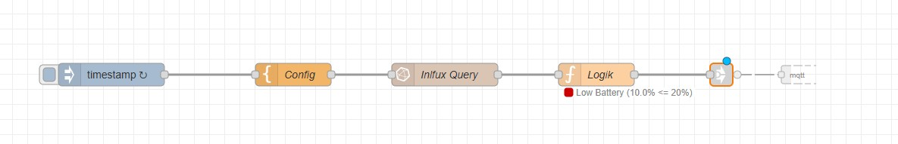

# Smart Solar Consumer Control (Node-RED)

## Overview

This Node-RED flow implements an intelligent control logic for high-power electrical consumers (e.g., heaters, pumps, EV chargers).

Instead of simple threshold switching, it calculates the **projected solar energy surplus** for the next 24 hours. It switches the consumer **ON** only if the surplus is sufficient to cover the runtime costs without draining the home battery below a reserved level.

It includes advanced protection features:
* **Hysteresis:** Prevents rapid toggling ("flip-flopping") by requiring a specific charge level recovery.
* **Safety Guard:** Prevents operation if forecast data is incomplete or outdated.
* **Battery Protection:** Hard cutoff when SoC is critically low.

---

## Wiring / Node Connections

To make this logic work, connect your Node-RED nodes in the following linear sequence:



`[Inject] --> [Template] --> [InfluxDB] --> [Function] --> [Output]`


### 1. Inject Node (Trigger)
* **Setting:** Set an interval (e.g., every 15 minutes).
* **Purpose:** Starts the process regularly.

### 2. Template Node (Configuration)
* **Setting:** Set "Property" to `msg.config`.
* **Format:** Select "JSON".
* **Content:** Paste your configuration JSON here (e.g., `{"consumer": {"min_soc": 10, ...}}`).
* **Purpose:** Loads the static settings into the message **before** the query runs.

### 3. InfluxDB Node (Data Fetch)
* **Setting:** Use the specific Flux query provided in the documentation.
* **Purpose:** Fetches the SoC and Forecast data.
* **Note:** The node writes the result to `msg.payload`, but it preserves the `msg.config` attached in the previous step.

### 4. Function Node (The Logic)
* **Setting:** Paste the JavaScript code provided for this project.
* **Purpose:** Performs the calculation, checks safety rules, and decides the state.

### 5. Output Nodes (Action)
* **Debug Node:** Connect `msg.debug_calc` to see the calculation details in the sidebar.
* **MQTT / HTTP / Switch:** Connect `msg.payload` to the node that actually controls your physical device (0=ON, 1=OFF).

---

## Architecture

### 1. Data Source (InfluxDB)
The flow expects an input message containing an array of objects from an InfluxDB Flux query.
* **Aggregation:** Data should be aggregated into 15-minute windows to optimize performance.
* **Required Fields:**
    * "type_soc": Current Battery State of Charge (%).
    * "type_forecast": Solar Irradiance Forecast (W).

### 2. Configuration (Template Node)
Configuration is passed via `msg.config.consumer`.

| Parameter | Description | Unit |
| :--- | :--- | :--- |
| min_soc | Critical battery level for emergency cutoff. | % |
| soc_hysteresis | Recovery buffer above min_soc to prevents toggling. | % |
| battery_capacity_kwh | Total capacity of the home battery. | kWh |
| reserve_kwh | Energy buffer to keep in the battery (target). | kWh |
| base_load_w | Average house consumption to subtract from solar gain. | W |
| consumer_power_w | Power consumption of the controlled device. | W |
| min_runtime_minutes | Minimum runtime used to calculate "Cycle Cost". | min |
| forecast_conversion_factor | Factor to convert Irradiance to AC Watts. | - |

---

## Logic & State Machine

The logic node processes the data in the following order:

### A. Data Validation
Checks if the configuration exists and if the InfluxDB payload contains valid SoC and Forecast data.

### B. Prediction Calculation
1.  Iterates through the forecast list (up to 24h).
2.  Calculates **Solar Yield** - **Base Load** = **Net Surplus**.
3.  Determines the **Surplus kWh** available above the target (Battery Capacity + Reserve).
4.  Compares this against the **Cycle Cost** (Energy needed to run the device for `min_runtime_minutes`).

### C. Safety & Decision Rules
The final switch state is determined by this priority list:

1.  **Low Battery Cutoff (Color: RED):**
    * If SoC <= min_soc, the device is forced **OFF**.
2.  **Hysteresis Recovery (Color: BLUE):**
    * If the device was previously **OFF** and the battery is charging, it remains **OFF** until SoC >= (min_soc + 20%).
3.  **Safety Guard (Color: BLACK):**
    * If valid forecast data covers less than **2.0 hours** (e.g., connection loss or end of day), the device is forced **OFF**.
4.  **Surplus Decision (Color: GREEN or ORANGE):**
    * If Surplus kWh >= Cycle Cost: Switch **ON**.
    * Otherwise: Switch **OFF**.

---

## Status Codes (Visual Indicators)

The Node-RED status dot provides immediate visual feedback:

| Color | Status | Meaning |
| :--- | :--- | :--- |
| **RED** | CRITICAL | **Hard Cutoff.** Battery is below min_soc or Config is missing. |
| **BLUE** | WAITING | **Charging.** Battery is above minimum but has not reached the recovery target (+20%) yet. |
| **BLACK**| SAFETY | **Data Issue.** Forecast horizon is too short (< 2h) to make a safe decision. |
| **GREEN**| ON | **Active.** Sufficient solar surplus calculated. |
| **ORANGE**| OFF | **Low Surplus.** System is healthy, but not enough sun to run the device. |
| **GREY** | ERROR | **No Data.** InfluxDB query returned no valid payload. |

---

## Outputs

### msg.payload (Switch Signal)
The node uses **Active Low** logic (or specific logic defined in your setup):
* 0 = **ON** (Enable Consumer)
* 1 = **OFF** (Disable Consumer)

### msg.debug_calc (Debugging)
A JSON object containing the full calculation details for the sidebar:
```json
{
  "state": "CALCULATED",
  "soc": 45.5,
  "solar_gain_kwh": 5.2,
  "surplus_kwh": 1.5,
  "required_cycle_kwh": 1.2,
  "forecast_hours": 12.5
}